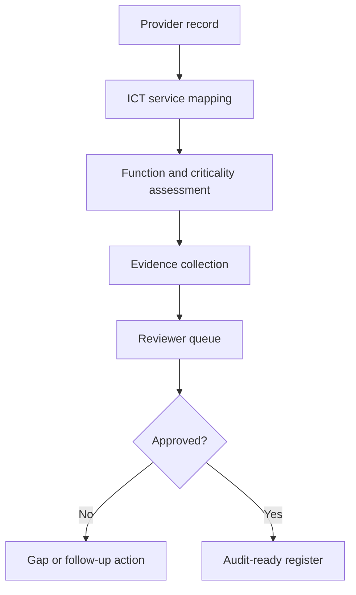

# DORA Third-Party Register and Resilience Workbench

A supervised legal engineering prototype for DORA third-party ICT risk governance.

The workbench helps regulated financial entities structure ICT provider records, map critical functions, track resilience obligations, prepare review workflows and maintain audit-ready evidence.

## Why this matters

DORA turns outsourcing and ICT risk into a continuously governed data problem. Legal review alone is not enough. Firms need structured registers, review states, escalation rules, evidence trails and human sign-off.

## Current scope

* ICT third-party register model
* Provider and service records
* Criticality classification workflow
* Review states and evidence fields
* Local-first prototype
* No client data
* No legal advice

## Workflow



## What this proves

* Financial regulation is increasingly a workflow and data architecture challenge.
* Legal engineers can translate regulatory obligations into operational systems.
* DORA implementation benefits from product thinking: register, review state, evidence, decision and escalation.

## Stack

* Next.js 16
* React 19
* TypeScript
* Prisma
* SQLite for local prototype storage
* Vitest

## Commands

```bash
npm run dev
npm run lint
npm run test
npm run build
```

## Safety note

This repository is a prototype. It does not provide legal advice and should not be used for production DORA compliance without professional review, security hardening and organisation-specific validation.
