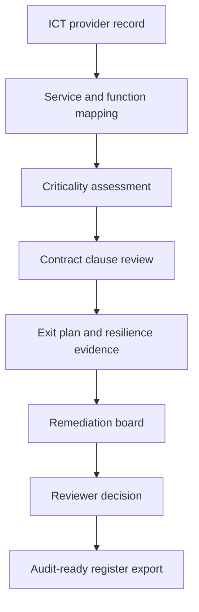

# DORA Third-Party Register and Resilience Workbench

DORA Third-Party Register and Resilience Workbench is a local-first supervised legal engineering prototype for ICT third-party risk governance under the Digital Operational Resilience Act.

The workbench helps a regulated financial entity structure ICT provider records, map services to critical or important functions, review mandatory contract clauses, track remediation, test resilience evidence, and prepare audit-ready register exports.

## Product Scope

* ICT third-party register for legal entities, vendors, services, contracts, and register entries.
* Criticality review workflow with reviewer state and evidence fields.
* Contract clause checks against DORA Article 30 requirements.
* Exit-plan, incident, resilience-test, and remediation tracking.
* Reviewed vendor communication drafts for remediation requests.
* Audit log and export surfaces for register review.

## Workflow



## What This Proves

DORA implementation is a data, workflow, and evidence problem. Legal review remains central, but the work becomes more reliable when obligations are translated into structured register data, deterministic validation, review states, and audit events.

The prototype demonstrates four product ideas:

* A register entry is only useful if its source records, validation status, and review history are visible.
* Critical or important ICT services need explicit exit-plan and resilience evidence.
* Contract clause gaps should create remediation work rather than disappear into a static memo.
* Vendor communications require draft status and review logging before any external send.

## Relationship to Regulatory Compliance OS

This repository is the standalone DORA source product for `Regulatory Compliance OS`.

The consolidated parent app mounts the DORA module under `/dora` and keeps the same boundaries:

* `src/app/dora`: register, contracts, resilience, remediation, export, and settings surfaces.
* `src/lib/dora`: validation, recalculation, DORA clause rules, and workflow-readiness helpers.
* `tests/dora`: ported DORA domain tests for validation, recalculation, remediation draft logging, and export readiness.

The standalone repository remains useful as a focused DORA proof surface. The parent app combines it with MiCAR authorization workflows and the EU financial-regulation horizon scanner.

## Stack

* Next.js 16 App Router
* React 19
* TypeScript
* Prisma 7
* SQLite for local prototype storage
* Vitest

## Quick Start

```bash
npm install
npm run prisma:generate
npm run dev
```

Open `http://localhost:3000`.

## Validation

```bash
npm run prisma:generate
npm run typecheck
npm run test
npm run build
npm run lint
```

Current validation status on 4 June 2026:

* `npm run test`: passed after expanding DORA workflow-readiness coverage.
* `npm run typecheck`: passed after adding Prisma generation and complete test fixtures.
* `npm run build`: passed for the current Next.js 16 route surface.
* `npm run lint`: still reports broad inherited lint debt, currently 99 errors and 26 warnings, mainly `no-explicit-any` and React 19 hook purity issues in UI and API routes. Treat this as a known hardening backlog.

## Main Paths

* `prisma/schema.prisma`: local SQLite data model for legal entities, vendors, ICT services, contracts, register entries, clause findings, remediation, incidents, exit plans, resilience tests, and audit logs.
* `src/lib/dora-rules.ts`: DORA Article 30 clause requirement catalogue.
* `src/lib/validators.ts`: deterministic register validation.
* `src/lib/recalc.ts`: recalculates register validation status from policy settings and related records.
* `src/lib/workflow-readiness.ts`: pure readiness helpers for criticality review, exit plans, remediation, and export blockers.
* `src/app/register`: ICT third-party register cockpit.
* `src/app/contracts`: contract ingestion and clause review surface.
* `src/app/resilience`: resilience testing and scenario surface.
* `src/app/remediation`: remediation board.
* `src/app/outreach`: reviewed vendor communication draft surface.
* `src/app/exports`: register and audit export surface.

## Safety Model

* This is a prototype and requires professional review before production use.
* Confidential client data requires security hardening before use.
* No legal advice or replacement for regulated-entity judgment.
* Vendor communications are prepared as editable drafts and logged only after human review.
* External sends, filing, client delivery, or publication require a separate approved action outside this prototype.
* Every legal or compliance output should retain source records, reviewer state, and audit evidence.

## Known Limits

* The DORA rule catalogue is a prototype representation of selected Article 30 contract checks.
* Organisation-specific scoping, competent-authority expectations, contract data quality, and ICT architecture facts materially affect any real assessment.
* Lint cleanup remains a hardening task across the older UI and API route surface.
* Production use would require authentication, tenant isolation, secret management, access logging, backup policy, and security review.
